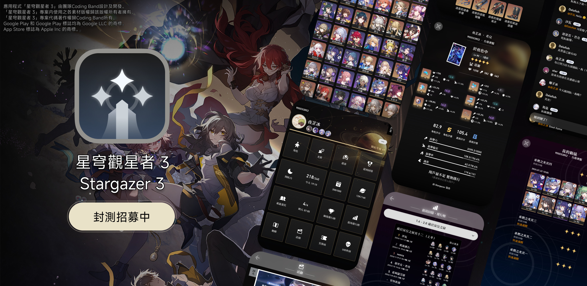
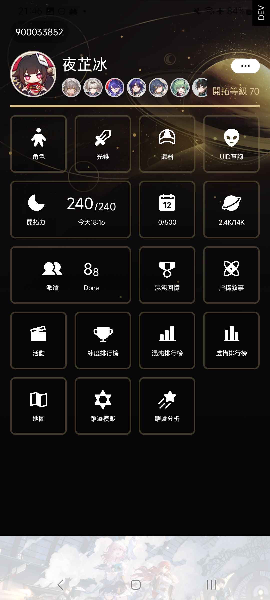
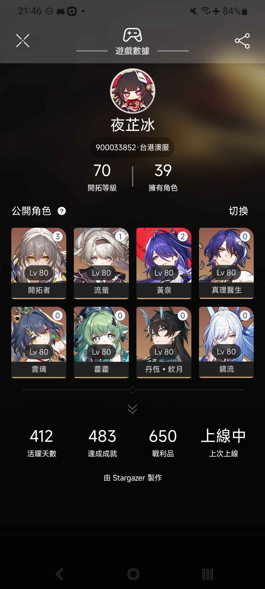
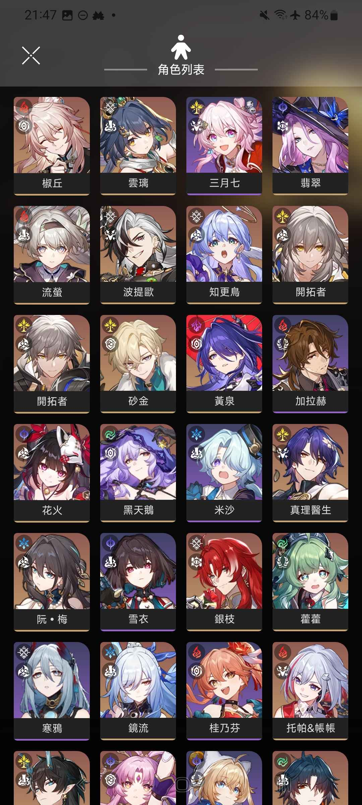
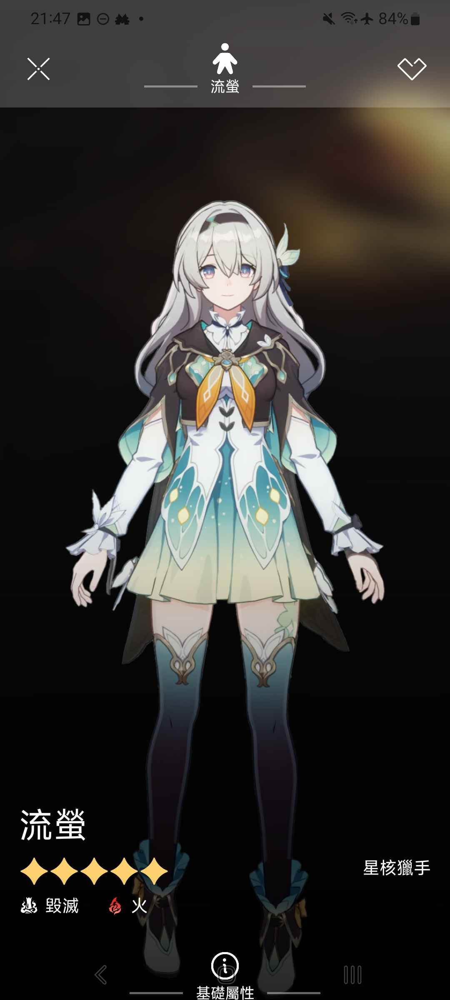

# 星穹觀星者 3

> *「開拓」之旅永不結束，他只是到了他的下一站* 
> 我們期望能透過重寫星穹觀星者，讓用戶體驗、營運優化、維護等方面更上一層樓 
> 亦希望延續開拓的精神，讓「星穹觀星者」繼續為各位開拓者提供更多幫助！

星穹觀星者 3 是由團隊[Coding Band](https://github.com/Coding-Band)開發
- [2O48](https://github.com/2O48) : UI/UX 設計
- [夜芷冰](https://github.com/Vocaloid2048) : Team Leader 兼代碼編寫
- [Somebody](https://github.com/ilikecatgirls) : 後端API代碼編寫

將於 Google Play Store 和 App Store 上架，讓使用 Android 和 iOS 的開拓者都能夠體驗星穹觀星者 3。

| 📢 如果不介意的話，可以透過 App 内捐款支持我們  |  |
|--------------------------------------------------------------------|------------------------------------------------------------------------------------------------------------------------------------------------------------------------------------------------------------------------------------------------------------|
| 📧 如果您想與我們合作，歡迎聯絡我們        |                                                                                                                         |

### 封測招募
>目前星穹觀星者 3 (Stargazer 3) 正招募封測人員 
>請參閱下方的招募條件及要求，並私訊`@yukina4096`以申請封測資格。

#### 封測細節
- 封測平台 : Android 和 iOS (手機爲主)
- 封測人數 : 200 人
- 封測時間 : 2024年8月7日 - 2024年9月6日
  - 第一階段：2024年8月7日 - 2024年8月20日
  - 第二階段：2024年8月21日 - 2024年8月27日
  - 第三階段：2024年8月28日 - 2024年9月6日
  - 封測期間仍接受申請~
- 第一階段（基礎功能）將會測試以下内容：
  - 角色、光錐、遺器資料及推薦
  - 用戶角色展示櫃、角色詳細資料
  - 首頁、設定（語言除外）
  - UID搜尋
- 第二階段（數據功能）將會測試以下内容：
  - 混沌回憶、虛構敘事、練度排行榜
  - 躍遷模擬、躍遷分析
  - 首頁自定義排版
  - 廣告、App內購買捐款
- 第三階段（高階功能）將會測試以下内容：
  - 排軸功能
  - 通知功能（體力滿了、App更新）
  - 平板介面適配

#### 招募條件
- 擁有 Android 或 iOS 裝置
  - Android : Android 7.0 或以上
  - iOS : iOS 15 或以上
- 願意測試及主動提供反饋
- 願意遵守封測規則
- 星鐵玩家將會優先考慮

*若您有意申請本次招募，歡迎先加入我們的伺服器、並私信`@yukina4096`:*
- 您想參加測試的平台(Android 或/和 iOS)
- 您的電郵地址 (iOS 的話請記得提供有綁定 Apple ID 的電郵)
- 您的星穹鐵道 UID （方便我們紀錄錯誤之類，測試時請用該 UID 的帳戶登錄）
我們會在收到您的申請後盡快回覆，並在伺服器給予相應的身份組謝謝！

#### 要求
- 不得公開、私下分發任何封測版本予任何人
- 不得拆包、捉包、反編譯、重新打包App（[按我看App源碼](https://github.com/Coding-band/Honkai-Stargazer)）
- 封測版本並不代表正式版，版本僅用作各方面早期測試，務必注意
- 不得惡意攻擊伺服器/使伺服器無法正常提供服務
- 請留意，團隊内所有成員均為志願工作，並不會有任何報酬，亦不會向其收取任何費用
- 任何違反規則者將被永久停止測試資格，並列入黑名單
- 請按照我們在Discord伺服器頻道内的指示進行測試

### Crowdin 翻譯進度

].data.translationProgress&url=https%3A%2F%2Fbadges.awesome-crowdin.com%2Fstats-15282854-638808.json>)
].data.translationProgress&url=https%3A%2F%2Fbadges.awesome-crowdin.com%2Fstats-15282854-638808.json>)
].data.translationProgress&url=https%3A%2F%2Fbadges.awesome-crowdin.com%2Fstats-15282854-638808.json>)
].data.translationProgress&url=https%3A%2F%2Fbadges.awesome-crowdin.com%2Fstats-15282854-638808.json>)
].data.translationProgress&url=https%3A%2F%2Fbadges.awesome-crowdin.com%2Fstats-15282854-638808.json>)
].data.translationProgress&url=https%3A%2F%2Fbadges.awesome-crowdin.com%2Fstats-15282854-638808.json>)
].data.translationProgress&url=https%3A%2F%2Fbadges.awesome-crowdin.com%2Fstats-15282854-638808.json>)
].data.translationProgress&url=https%3A%2F%2Fbadges.awesome-crowdin.com%2Fstats-15282854-638808.json>)
].data.translationProgress&url=https%3A%2F%2Fbadges.awesome-crowdin.com%2Fstats-15282854-638808.json>)
].data.translationProgress&url=https%3A%2F%2Fbadges.awesome-crowdin.com%2Fstats-15282854-638808.json>)
].data.translationProgress&url=https%3A%2F%2Fbadges.awesome-crowdin.com%2Fstats-15282854-638808.json>)
].data.translationProgress&url=https%3A%2F%2Fbadges.awesome-crowdin.com%2Fstats-15282854-638808.json>)
].data.translationProgress&url=https%3A%2F%2Fbadges.awesome-crowdin.com%2Fstats-15282854-638808.json>)

## App 特點 - 為何選擇星穹觀星者 3？

(之後補充)

## App螢幕截圖
|  |  |  |  |
|-----------------------------------------|-----------------------------------------|-----------------------------------------|-----------------------------------------|

## 幫幫我，開拓者

我們目前在招募志願者協助我們提升 App 的質量:

### 翻譯 （把 App 的文字變成朋友都能看懂）
- 語言不限
- 人數不限
- 使用 Crowdin 翻譯協作平台

### Beta 測試員 （在功能推出前先幫忙找 Bug）

- 人數：200 人 (Android 和 iOS)
- 需要遵守<守則>
- 違犯規則者將被永久停止測試資格
- 請私信`@yukina4096` 提出申請，並提供以下資料 :
  - 使用的平台(Android / iOS)
  - 接收BETA測試的電郵 (iOS 的話請記得提供有綁定 Apple ID 的電郵)
  - 星穹鐵道 UID （方便我們紀錄錯誤之類，還請測試時用那個 UID 的帳戶登錄）

### <守則>

- 不得公開、私下分發 BETA 版本予任何人
- 不得拆包、捉包、反編譯 、重新打包 App
- BETA 版本並不代表正式版，務必注意
- 不得惡意攻擊伺服器/使伺服器無法正常提供服務
- 請留意，團隊内所有成員均為志願工作，我們不會亦不可能要求視其為員工
- 志願工作並不會有任何報酬，亦不會向其收取任何費用
- 任何違反規則者將被永久停止測試資格

### 關於 Coding Band

Coding Band 由 3 位核心成員組成,分別是 : 

- 《設計大佬》[2O48](https://github.com/2O48)
- 《禮貌貓咪》[夜芷冰](https://github.com/Vocaloid2048)
- 《Furina》[Somebody](https://github.com/ilikecatgirls)
  

## 後日談 - 為何重寫？
(之後補充)